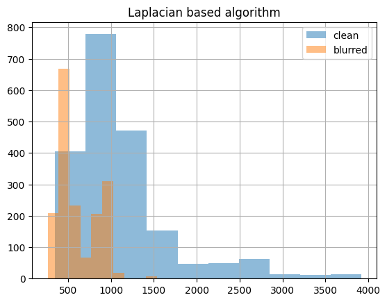
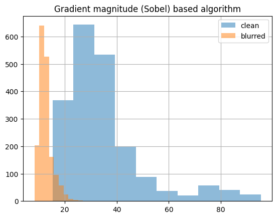
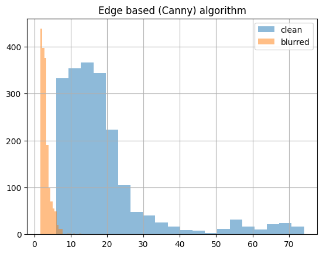
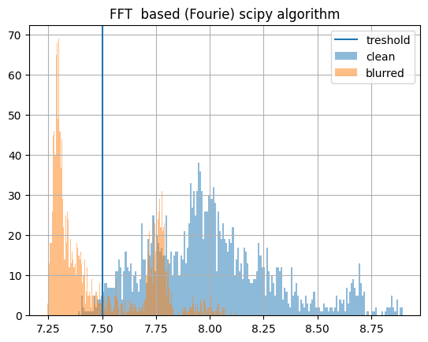
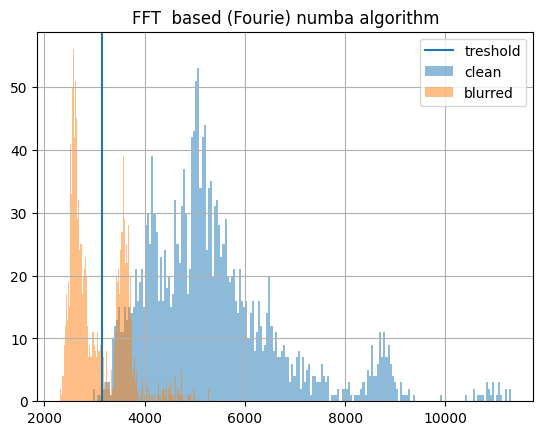

# Blur Detection — Classical Methods

A small research project that compares **classical (non-deep-learning) blur detection
metrics** on a dataset of sharp vs. blurred photos, benchmarks their runtime, and shows
that **combining several cheap metrics with a simple classifier** beats any single metric
on its own.

No neural network, no GPU. Everything runs on a CPU with OpenCV + NumPy.

---

## TL;DR — the main finding

Each metric alone is a weak detector: a single global threshold gives only **~40–60%
accuracy**, because the "sharp" and "blurred" distributions overlap heavily (see the
plots below).

But the four metrics are *complementary*. Feed all of them into a standardized
**k-Nearest-Neighbors** classifier and accuracy jumps to **~96–97%**:

```
              precision    recall  f1-score   support
           0       0.96      0.98      0.97       477   # sharp
           1       0.97      0.95      0.96       344   # blurred
    accuracy                           0.97       821

confusion matrix:
[[468   9]     # sharp:  468 correct, 9 flagged as blurred
 [ 18 326]]    # blurred: 326 correct, 18 missed
```

---

## The four blur metrics

All of them operate on a grayscale image and return a single scalar. The idea is the same
everywhere: **blur removes high-frequency detail**, so a blurred image has less edge
energy / less high-frequency content than a sharp one. Lower score ⇒ more likely blurred.

| Metric | How it works | OpenCV / NumPy core |
|---|---|---|
| **Laplacian variance** | Variance of the Laplacian. Sharp edges ⇒ high variance. The classic "is it blurry?" trick. | `cv2.Laplacian(img, CV_64F).var()` |
| **Gradient magnitude** | Mean of the Sobel gradient magnitude `√(Gx² + Gy²)`. Strong gradients ⇒ sharp. | `cv2.Sobel(...)` |
| **Frequency-based (FFT)** | Mean magnitude of the (shifted) 2D Fourier spectrum. Sharp images carry more high-frequency energy. | `np.fft.fft2` / `fftshift` |
| **Edge-based (Canny)** | Density of Canny edge pixels (`sum(edges) / image.size`). More detected edges ⇒ sharper. | `cv2.Canny(img, 50, 150)` |

Reference implementations live in [`time_checker.py`](time_checker.py) and
[`validate_methods.py`](validate_methods.py).

---

## Why one threshold isn't enough

[`validate_methods.py`](validate_methods.py) applies a single global threshold (200) to
each metric and scores it. The result ([`results.csv`](results.csv)):

| Method | Accuracy | Precision | Recall | F1 |
|---|---|---|---|---|
| laplacian_variance | 58.8% | 0.00 | 0.00 | 0.00 |
| gradient_magnitude | 41.2% | 0.41 | 1.00 | 0.58 |
| frequency_based    | 58.8% | 0.00 | 0.00 | 0.00 |
| edge_based         | 41.2% | 0.41 | 1.00 | 0.58 |

The numbers are bad on purpose — a fixed threshold either flags nothing or flags
everything. The distribution histograms (in [`plots/`](plots/)) show why: the sharp
(blue) and blurred (orange) populations overlap a lot.

| Laplacian | Sobel gradient | Canny edges |
|---|---|---|
|  |  |  |

| FFT (NumPy) | FFT (SciPy) | FFT (Numba) |
|---|---|---|
|  |  |  |

The full exploration — histograms, per-metric thresholds, error inspection, feature
scaling, and the KNN model — is in [`research.ipynb`](research.ipynb).

---

## Runtime benchmarking

Blur detection is often a preprocessing step, so speed matters. The FFT metric is the most
expensive, so three implementations are compared: **NumPy**, **SciPy** (`scipy.fftpack`),
and **Numba** (`@njit`). Each metric is wrapped with a `time_it` decorator that returns
`(value, seconds)`; per-image timings are stored alongside the metric values
(`*_ms` columns in the notebook) so you can trade accuracy for latency.

---

## Repository layout

```
.
├── research.ipynb       # Full research: metrics, histograms, scaling, KNN classifier
├── validate_methods.py  # Standalone single-threshold evaluation → results.csv
├── time_checker.py      # Metric implementations + time_it decorator + FFT variants
├── results.csv          # Single-threshold scores per method
├── plots/               # Metric distribution histograms (sharp vs blurred)
└── .gitignore           # Dataset and virtualenv are excluded
```

---

## Setup & usage

Requires Python 3.

```bash
python3 -m venv env && source env/bin/activate
pip install opencv-python numpy pandas scikit-learn matplotlib numba scipy
```

Run the single-threshold evaluation (edit the folder paths near the bottom of the file
first — see below):

```bash
python3 validate_methods.py     # writes results.csv and shows the accuracy plot
```

Or open the notebook to reproduce the full study:

```bash
jupyter notebook research.ipynb
```

---

## Dataset

The image dataset is **not included** (it is `.gitignore`d). The code expects two folders
of grayscale-readable images:

```
<dataset>/blur/    # blurred images  (label 1)
<dataset>/clear/   # sharp images    (label 0)
```

Both [`validate_methods.py`](validate_methods.py) and the notebook currently point at
**hard-coded local paths** (e.g. `fin_dataset_last/blur/...`). Update them to your own
dataset location before running. Any set of sharp/blurred image pairs will work.

---

## Notes & limitations

- Scores are **dataset- and resolution-dependent** (the notebook resizes to 640×480).
  Re-tune thresholds for your own images.
- The single-threshold script is a baseline to demonstrate *why* the combined classifier
  is needed — don't expect good numbers from it.
- The KNN result (~97%) is on a held-out split of this specific dataset; treat it as an
  illustration of the "combine cheap metrics" idea, not a universal benchmark.
